# Overview

Welcome to this overview of R Markdown. This tutorial is intended to take 1 hour and was developed originally as part of the <a href="https://www.soils.org" target="_blank">2020 ASA-CSSA-SSSA International Annual Meeting</a> that was held virtually from November 9-13, 2020.

<i>Please note all session goal modules will be posted by November 8, 2020.</i>

# Session goals

This session has multiple goals. You can view these components in any order. 

* [Session at a glance](#session-at-a-glance)
* [Share resources](#share-resources)
* [Discuss the importance of code and documentation](#Discuss-the-importance-of-code-and-documentation)
* [Explain what R Markdown is](#Explain-what-R-Markdown-is)
* [Getting started in R Markdown](#getting-started-in-r-markdown)
* [Explain what a code chunk is](#explain-what-a-code-chunk-is)
* [Run code outside a code chunk](#run-code-outside-a-code-chunk)
* [Demonstrate how multiple languages can be used in R Markdown](#demonstrate-how-multiple-languages-can-be-used-in-R-Markdown)
* [Create links within an R Markdown file](#create-links-within-an-R-Markdown-file)
* [Create tables in R Markdown](#create-tables-in-R-Markdown)
* Show how to format an word document 
* Show how to load in a file with a uniform naming structure
* Provide an example file for additional editing and revising

## Session at a glance

Here's a quick 5 W's overview of this session to help you determine if these materials will be useful for you.

<b>Who should take this session?</b>:

If you are interested in creating reproducible analytical routines that can be used to generate reports or other data summaries, this session might be of interest to you!

<b>What is this session?</b>

This sessions is a collection of overivews for different components of working with RMarkdown files.

<b>When should I complete this session?</b>

Please feel free to review these materials at any time. This tutorial will remain up online and will be modified in the future.

<b>Where should I complete this session?</b>

You can complete this session by reviewing the materials here. It could also be helpful to have a copy of RStudio installed on your computer and work through the examples. But, it's not required to have RStudio on your computer to view these materials. All materials are posted here.

<b>Why should I complete this session?</b>

This session should help you get an initial overview about using R Markdown. I don't mean to suggest everything about using R, Markdown, or R Markdown is covered in this tutorial. There's always more to learn!

If any of the above questions and answers sounded good to you, please read on!

<hr>

* [Back to Session goals](#session-goals)

<hr>


## Share resources

There are multiple overviews of RMarkdown available online. You might find the following resources of interest. Please feel free to suggest other resources to include on this list too!

* <a href="https://bookdown.org/yihui/rmarkdown/" target="_blank">R Markdown: The Definitive Guide</a> by Yihui Xie, J. J. Allaire, Garrett Grolemund
* <a href="https://rmarkdown.rstudio.com/" target="_blank">General overview from RStudio</a>
* <a href="https://rmarkdown.rstudio.com/articles.html" target="_blank">Series of RMarkdown related articles from RStudio</a>
* <a href="https://rmarkdown.rstudio.com/lesson-1.html" target="_blank">Lession 1 from RStudio about RMarkdown</a>
* <a href="https://guides.github.com/features/mastering-markdown/" target="_blank">An Overview of Markdown from GitHub</a>
* <a href="https://www.markdownguide.org/basic-syntax/" target="_blank">The Basic Syntax page from the Markdown guide</a>

<hr>

* [Back to Session goals](#session-goals)

<hr>


## Discuss the importance of code and documentation

Well-documented code provides one piece of achieving the goal of reproducible science. Given your dataset and code, someone else should be able to evaluate the dataset using your code and find the same results. Your study is <i>reproducible</i> if others can take these steps. Another aspect of scientific research is <i>replicability</i>, which relates to more running a study under different conditions, such as using a different dataset or in a laboratory different from the laboratory that you used, and be able to find similar results. 

One way to think about these two topics is as follows:

* reproducibility = use same dataset and code, receive the same results

* replicability = use the same research question, different dataset, receive similar results to support the overall finding

For example, let's say you write a paper about how soil characteristics respond to a series of crop and soil management decisions, including tillage type and crops planted. You help <i>scientific reproducibility</i> by including your dataset and code so that others can use your dataset and code to match the results you present in the paper.

In this same paper, you fully describe your research study methods so that someone else could try and run the whole study again, perhaps on a different soil type or in a different climate. With these thorough descriptions you help <i>scientific replicability</i> because someone else could run a new study and see if their findings are similar to your current study.

I don't intend to exclude modelling or other computer-based study types from this description. In the above example I hope to differentiate between reproducibility and replicability. 

An R Markdown file provides one method (and certainly not the only method) for creating reproducible science. You can write annotations to your code and run the code in the same document. Readers will see the code you used and the output side-by-side. If an interested reader would like to run the analysis, they can take the code you used and compare line-by-line output with the results you presented in your study.

With an overall goal of reproducible science, many methods can be used to achieve this goal. Detailed descriptions can be written alongside any code results. You can run an analysis and print all the console results. You can use other code documentation methods, such as <a href="https://jupyter.org/" target="_blank">Jupyter Notebook</a>. 

For more information about how code is a component of reproducible and replicable science, please see the National Academies of Sciences, Engineering, and Medicine consensus report titled: 
<a href="https://www.nap.edu/read/25303/chapter/2" target="_blank">Reproducibility and Replicability in Science</a>.


<hr>

* [Back to Session goals](#session-goals)

<hr>

## Explain what R Markdown is

<a href="https://bookdown.org/yihui/rmarkdown/basics.html" target="_blank">Chapter 2 of R Markdown: The Definitive Guide</a> provides an excellent summary of what R Markdown is:  

```
"an authoring framework for data science"
```

In summarizing the two key points raised at the beginning of chapter 2, R Markdown allows you to (1) write and run code, and (2) create data reports that can be shared with others.

R Markdown can take R code (and several other code types too), run the code, and show you the code and the associated output in a report. This report can be created as an html file, a PDF, or a word document. The example used in the [Getting started in R Markdown](#getting-started-in-r-markdown) section shows how to write output to an html file. You could subsequently print this file and save as a pdf, though this is a little different than writing to a pdf directly.

R Markdown provides a method for combining your code with additional descriptive text to create a report. If you find yourself running similar code over and over again, copying and pasting into a new document, formatting, and so forth, creating a data analysis routine in R Markdown could be an option to consider.

For example, you might be interested in evaluating a dataset that is updated every week or maybe once every month (or possibly every day). The file format remains the same, but you are creating new data summaries from each file. You could create an R Markdown file that processes and analyzes the file in a consistent way and provides an output report. This standardized method could help you review the data more quickly, share these results with others, and then identify parts of the dataset that may require new analysis and code to be written.

<hr>

* [Back to Session goals](#session-goals)

<hr>

## Getting started in R Markdown

You might be interested in starting with a test file. The following steps will generate an example test file using RStudio.

1. Please make sure you have <a href="https://rstudio.com/" target="_blank">R Studio</a> installed on your computer.

2. Go to the top of the browser and create a new markdown file. 

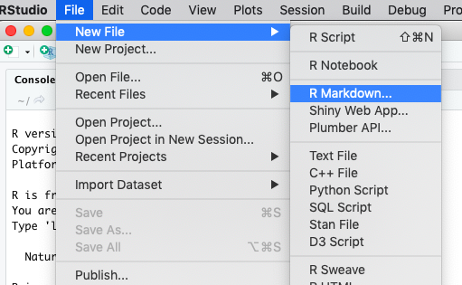

3. Create a name for the new R Markdown file

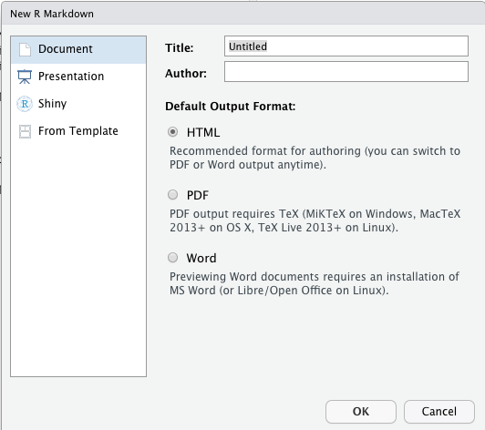

4. Your initial R Markdown file is created! There's several pieces of helpful code that are automatically created within the document.

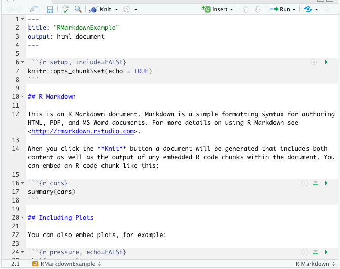

5. Look to the top menu and select Knit > To HTML

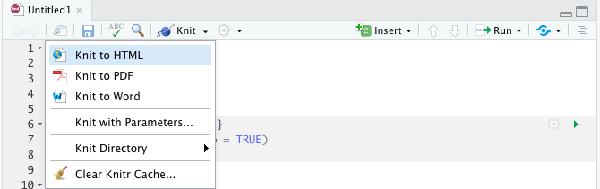

6. Type in a name for the new html output file.

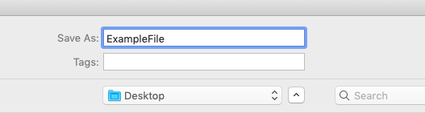

7. The code should be procesed and knit. The new html file will appear!

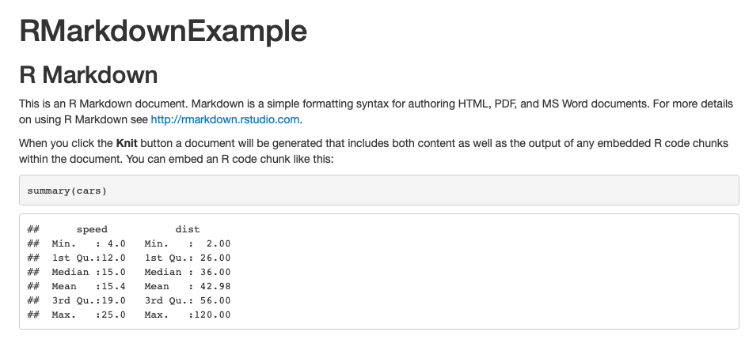

8. Check the R Markdown window that is located next to the tabs Console, Terminal, and Jobs.

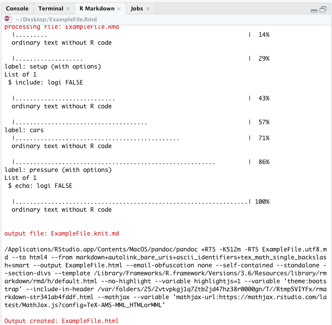

You will see how RStudio processed each of the code chunks and provides information about how the processing occurred. If you are trying to knit a file, this output can helpful to identify where the code might be breaking and need modification.

9. You'll have two files, one with an .Rmd file type and one with an .html file type.

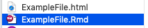

If you wanted to make edits to the html file, the best way is to edit the .Rmd file, knit a new file, and then you'll have a new html file!

<hr>

* [Back to Session goals](#session-goals)

<hr>

## Explain what a code chunk is

In R Markdown, a code chunk is any set of code that starts with three single quotes in a row and ends with three single quotes in a row.

In the example image below, the code chunk is written in R. Everything outside the code chunk, but still in the same R Markdown document, is written in Markdown. 

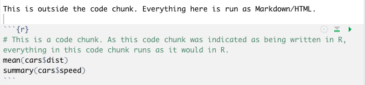

After the page is knit, the same results appear as follows:

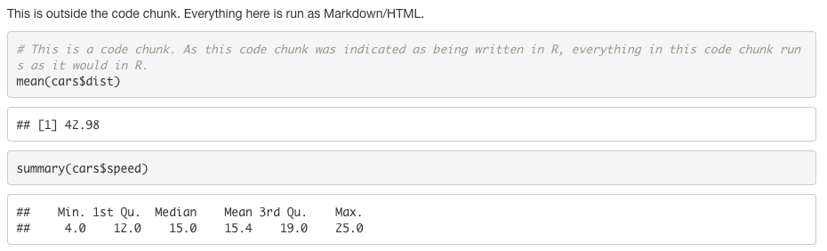

There are many options available when setting up a code chunk. These can affect how the code is printed, if the code is run, how plots appear, and other factors. R Studio has a <a href="https://rmarkdown.rstudio.com/lesson-3.html" target="_blank">short list of options here</a> and a <a href="https://rstudio.com/wp-content/uploads/2015/03/rmarkdown-reference.pdf" target="_blank">longer list of all options in this pdf</a>.

As a brief example, here is an example of how the include and echo options appear in R Markdown and after being knit.

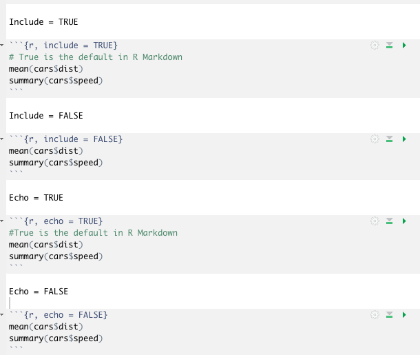

Once this code is knit, the options appear as shown below. Please note that the TRUE setting is the default in R Markdown for these two examples.

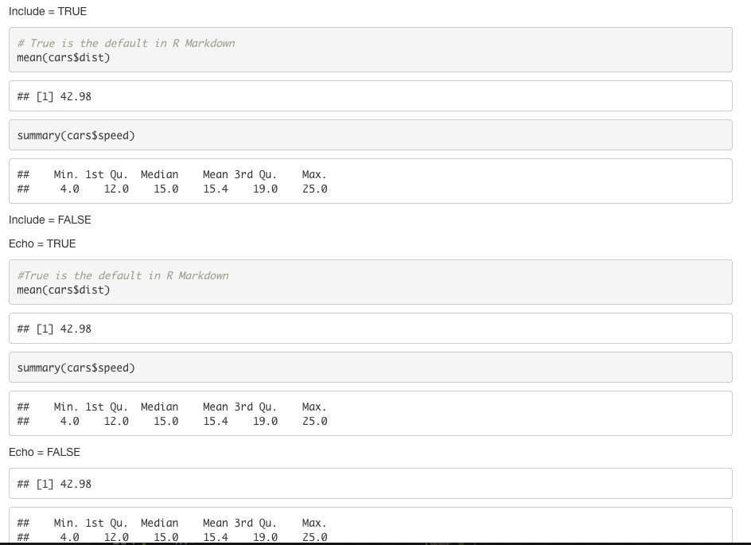

<hr>

* [Back to Session goals](#session-goals)

<hr>

## Run code outside a code chunk

You may be interested in running code outside of a code chunk. This is also possible in RMarkdown. For running code in line, you use a single quote around the statement you are interested in processing.

In R Markdown, a line of code like this

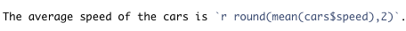

will appear like this after knitting

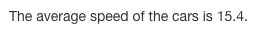

This technique is helpful if you want to write sentences or paragraphs that have combinations of written text and results. For example, the text that you write can be responsive to results that you generated in a previous section.

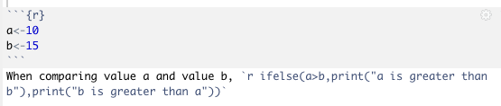

After knitting the code above, the text can then react to those new values.

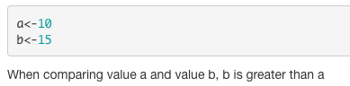

<hr>

* [Back to Session goals](#session-goals)

<hr>

## Demonstrate how multiple languages can be used in R Markdown

Multiple langauges can be set up in a code chunk.

For example, here are the languages that are listed when I run the following command.

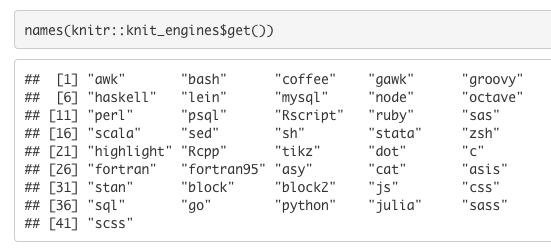

For example, python can be run in R Markdown. When using python, there is the reticulate package that can also be downloaded. The chunk option below allowed the python code to be run without the reticulate package.

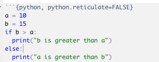

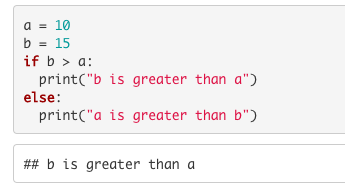

One option that could be of interest to you is combining code that is written in R, Stata, and SAS Software. For example, you might be working on a collaborative project in which pieces of code have been written in multiple languages. Combining these code together could be helpful for maintaining the code and results in a single place and generating ideas for new analyses.

When running Stata or SAS Software in R Markdown, you will need to set up an additional engine pathway. This pathway can be set manually and there are also packages that can help you set up the pathways too.

For example, Doug Hemken has a series of tutorials on using <a href="https://www.ssc.wisc.edu/~hemken/Stataworkshops/Stata%20and%20R%20Markdown/StataMarkdown#setting-up-the-stata-engine" target="_blank">Stata in R Markdown</a> and a set on using <a href="https://www.ssc.wisc.edu/~hemken/SASworkshops/Markdown/SASmarkdown.html" target="_blank">SAS in R Markdown</a>.

If you need to set a pathway manually, you can direct the engine to the .exe file on your computer, <a href="https://bookdown.org/yihui/rmarkdown-cookbook/eng-stata.html" target="_blank">as is described here</a>.

These code chunks will only work if you have Stata and SAS Software installed on your computer. 


<hr>

* [Back to Session goals](#session-goals)

<hr>

## Create links within an R Markdown file

When you are making your R Markdown report, you may be interested in knitting to an HTML file and allowing the user to navigate to different sections of the report.

One method for creating internal links within the knit HTML file is to use a series of headers and links. 

When building a link, you need to create the linking name and where the link will go. Then, you need to create a heading that matches where the link goes. 

For example, you might want the report to start with a section that describes the latest research findings.

```
[See the latest research findings](#newfindings)
```

The content in the square brackets is the text that will appear in the R Markdown HTML file. The content in the parentheses is the link name.

In the above example, if a user clicks on the phrase "See the latest research findings," they will be sent to some part of the document that includes the link name (#newfindings).

At another point in the document, you need to create the landing point for this link.

```
## New findings to report {#newfindings}
```

You could create a new header in the document and include this link text {#newfindings}. Now when a user clicks the link you created above, they will be transported to this header because the #newfindings text links these two parts of the report.

How could you direct the user back to the original link? One option for a report is to create a series of links in a table of contents at the report's beginning. You can do the same link making process.

At the end of a section, you can create a link that sends the user back to the table of contents.

```
[Back to table of contents](#toc)
```

At the top of the document, you can create a landing point for this link. When users click on the "Back to the table of contents" link, they will be transported to the "Table of contents" header.

```
## Table of contents {#toc}
```

The example file at the end of this tutorial has examples of links as well!


<hr>

* [Back to Session goals](#session-goals)

<hr>

## Create tables in R Markdown

Tables can be created in R Markdown using several methods. For example, if you are knitting directly to an HTML file, you can create a table using HTML commands.

The code below is HTML, and if you placed this code outside of a code chunk, the table would appear in a HTML file.

```(html)
 <table style="width:50%">
  <tr>
    <th>Column One</th>
    <th>Column Two</th>
  </tr>
  <tr>
    <td>Variable One</td>
    <td>Variable Two</td>
  </tr>
  <tr>
    <td>10</td>
    <td>40</td>
  </tr>
</table> 
```

Another way to make tables in R Markdown files is to use the <a href="https://bookdown.org/yihui/rmarkdown-cookbook/kable.html" target="_blank">knitr::kable function</a>. This link contains an authoritative overview of how knitr::kable operates. There are many options for knitr::kable tables. The example shown below is intended to be a short introduction to creating tables.

For example, you might be interested in creating a table of summary statistics for a given set of variables. For this example, we will use the <a href="https://stat.ethz.ch/R-manual/R-devel/library/datasets/html/zCO2.html" target="_blank">C02 dataset from R</a>.

For example, you might be interested in evaluating the carbon dioxide uptake rates by plant type and treatment.

The following code creates the summary statistics by plant type and treatment.

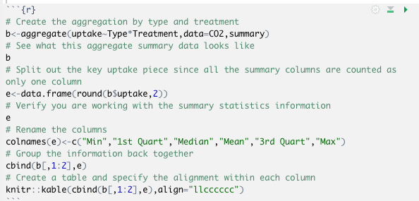

All of the pieces in the above code are knit and displayed to show how the same information can appear multiple ways in an knit HTML file.

The first part of the code does display the information after running the aggregate command. 

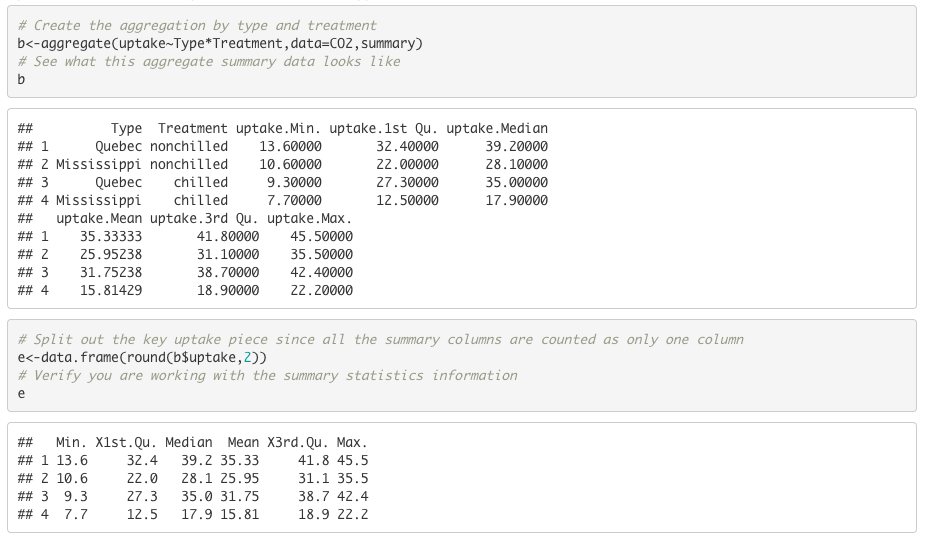

By renaming some of the columns and merging the columns back to the type and treatment information, you can create a table that has the same data, just presented in a different format. The knitr:kable formatting provides a well-organized table that can work well in a report.

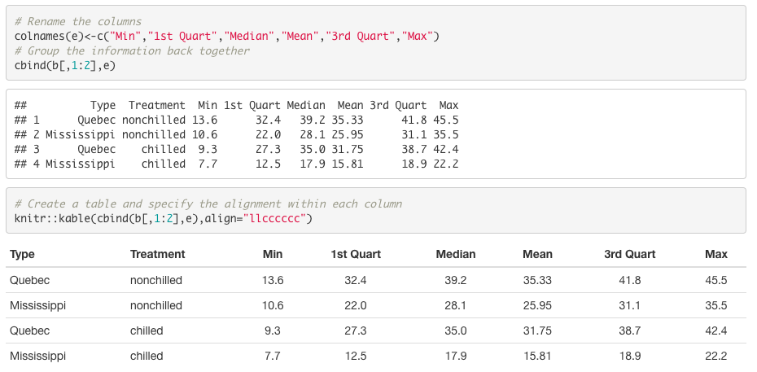

Interested in adding a caption to the table, maybe to title this table: Table 1. Summary of carbon dioxide uptake by growth treatment and plant type. Within the knitr:kable commmand, you can add a <a href="https://bookdown.org/yihui/rmarkdown-cookbook/kable.html#tab:kable-cap" target="_blank">caption option</a> where you enter the name that you would like to use for the table.

In the resources listed at the beginning of this document was the R Markdown introduction from R Studio. This documentation includes a <a href="https://rmarkdown.rstudio.com/lesson-7.html" target="_blank">page about Tables</a> that shows additional options and packages for creating tables in R Markdown.

<hr>

* [Back to Session goals](#session-goals)

<hr>